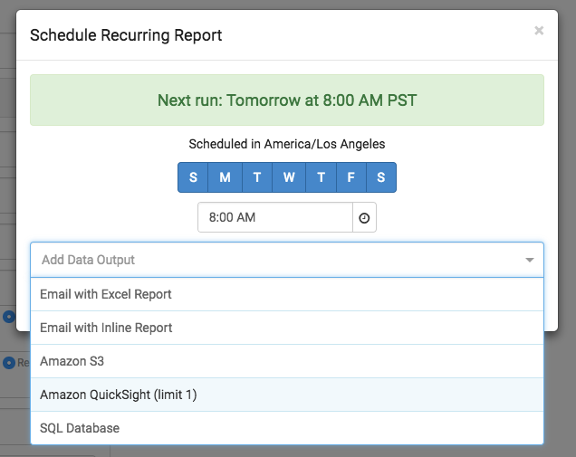
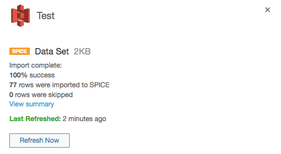

# Integration with Amazon QuickSight (beta)

[Amazon QuickSight](https://quicksight.aws/) is a fast, cloud-powered business analytics service that makes it easy to build visualizations, perform ad-hoc analysis, and quickly get business insights from your data.

While QuickSight has great integration with 1st party data sources like internal databases, building custom data feeds, especially from 3rd party data sources like Google Analytics, can be challenging and require significant engineering effort.

However, with our integration partnership, users can quickly create custom, aggregated data feeds using DataBlade's drag-and-drop tools and begin populating QuickSight with 1st and 3rd party data, no engineering required.

This tutorial will guide you through the process of setting up a DataBlade project that automatically sends data to QuickSight.

## Setting up S3
S3 is Amazon's file storage service. In order for DataBlade to send data to QuickSight, you will need to [create an S3 bucket](http://docs.aws.amazon.com/AmazonS3/latest/gsg/CreatingABucket.html).

Next, you will have to grant permissions for DataBlade to access this S3 bucket.

1. In DataBlade, select *Data Integrations and Files* from the left navigation
2. Click the *Add Integration* dropdown and select *Amazon S3*
3. Give your S3 integration a name and enter your Access Key ID and Secret Key. If you are unsure about how to obtain these credentials, ask your IT department or email us at [support@datablade.io](mailto:support@datablade.io).
4. Click the *Create* button. If you have entered your credentials correctly, you will see a message indicating that the integration was added successfully.

## Setting up QuickSight permissions
In order for QuickSight to be able to access the files sent by DataBlade, you will have to grant it permissions to access the bucket you created in the previous step.

1. Once logged into QuickSight, click your user icon in the top right and select *Manage QuickSight*
2. On the left, click *Account Permissions*, then click *Edit AWS Permissions*
3. Next to *Amazon S3*, click *Choose Permissions* and check the box next to the S3 bucket you created earlier
4. Click the *Apply* button

## Setting up your DataBlade project
This tutorial assumes that you already have a working knowledge of how to use DataBlade. If you need a refresher, please check out our [general guide](../README.md).

A few notes on how to create an optimal DataBlade project for sending data to QuickSight. Once the integration leaves beta, many of these restrictions will be lifted or addressed to be more user friendly:

* DataBlade currently only supports sending incremental updates to QuickSight. This means that each time you schedule your project to run, it should only generate new data that the last scheduled run did not have. For example, if you create a project that pulls session counts from Google Analytics and schedule it to send data to QuickSight daily, you should make sure that your Google Analytics query only generates a single day's worth of data. This way, every time the project runs, DataBlade will incrementally send 1 new day's worth of data to QuickSight.

1. In the top right, click *Schedule*. Use the interface to set a schedule at which the project should run and send data to QuickSight
2. In the *Add Data Output* dropdown, select *Amazon Quicksight*
3. In the *Integration* dropdown, select the DataBlade S3 integration you created earlier
4. From the *Bucket* dropdown, select the S3 bucket you created earlier for storing QuickSight data
5. From the *Data Source* dropdown, select the data source from your project that you would like to populate QuickSight with
6. You can leave the remaining fields as-is. Copy the value in *Manifest*, as you'll need this in the next step

## Setting up your QuickSight data source
Data sent to QuickSight from DataBlade is represented as a data source. Once logged into QuickSight:

1. Click *Manage data* in the top right
2. Click *New data set* in the top left
3. Click *S3*
4. Provide a name for your data source and paste in the *Manifest* value from your DataBlade project
5. Click *Connect* and then in the next screen, click *Visualize*
6. You are now ready to begin visualizing the data sent over from DataBlade!

Depending on the schedule you specified, DataBlade will automatically run your project and send the data over to QuickSight. Unfortunately, QuickSight does not currently support automatic data refresh, so while DataBlade will continue to send data over, if you want to see the latest values reflected in your QuickSight visualizations, you will need to go to *Manage data* and click *Refresh now* for your data set.

